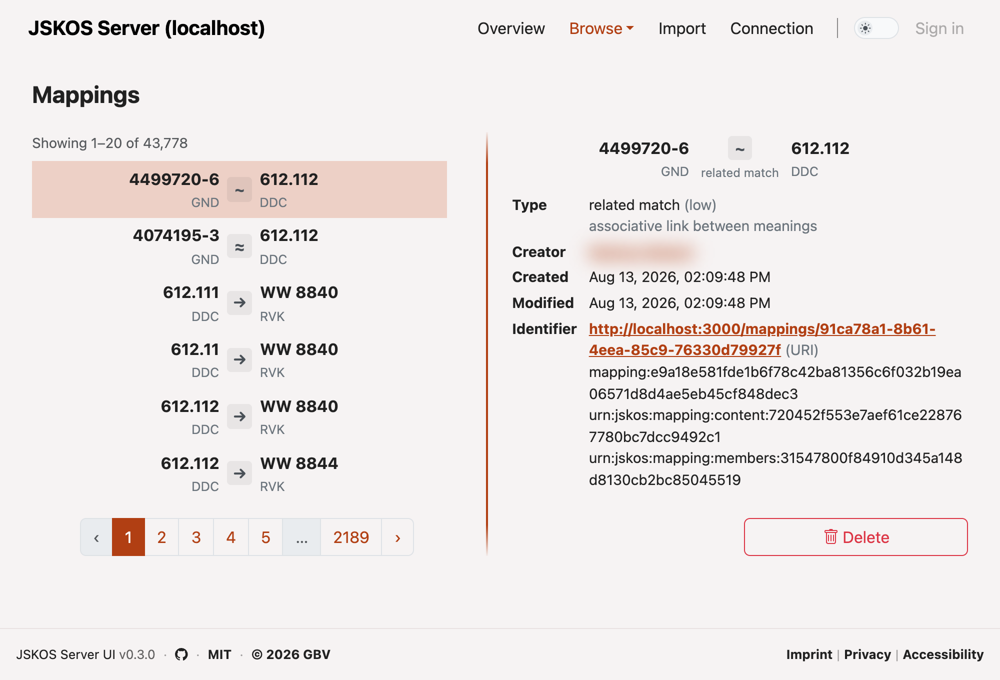

<div align="center">

# JSKOS Server UI

**A web-based frontend for [jskos-server](https://github.com/gbv/jskos-server) instances.**

[](https://www.npmjs.com/package/jskos-server-ui)
[](https://github.com/gbv/jskos-server-ui/pkgs/container/jskos-server-ui)
[](https://github.com/gbv/jskos-server-ui/actions/workflows/test.yml)
[](https://codecov.io/gh/gbv/jskos-server-ui)
[](LICENSE)

**[Live demo →](https://coli-conc.gbv.de/jskos-server-ui/)**

[](https://coli-conc.gbv.de/jskos-server-ui/)

</div>

## Features

- **Browse:** terminologies, concepts, concordances, mappings, registries, annotations
- **Import:** upload JSKOS data from a file or a URL
- Connect to any jskos-server instance at runtime

Built with [Vue 3](https://vuejs.org/) and [Vite](https://vitejs.dev/), using
[cocoda-sdk](https://github.com/gbv/cocoda-sdk) for all API communication,
[jskos-vue](https://github.com/gbv/jskos-vue) for JSKOS-specific components, and
[Bootstrap 5](https://getbootstrap.com/) via [bootstrap-vue-next](https://bootstrap-vue-next.github.io/bootstrap-vue-next/).

## Usage

The application can be deployed as a Docker container or as a static build. It uses hash-based
routing, so it can be served from any path without server-side rewrites. Its components can
also be used as a Vue library.

### Docker Compose (recommended for production)

A ready-to-use `docker-compose.yml` is included in the root of this repository. It starts jskos-server-ui, [jskos-server](https://github.com/gbv/jskos-server), and MongoDB.

```bash
docker compose up -d
```

The UI is then available at `http://localhost:8080`, jskos-server at `http://localhost:3000`.
Configuration is read from `docker/config.json`, which is mounted into the container and uses the format described under [Configuration](#configuration).

### Docker (standalone)

To run only the UI against an existing jskos-server instance:

```bash
docker run -p 8080:80 ghcr.io/gbv/jskos-server-ui:latest
```

The image ships with a default `config.json`. To point the UI at your own services, mount a replacement over it:

```bash
docker run -p 8080:80 \
  -v /path/to/config.json:/usr/share/nginx/html/config.json:ro \
  ghcr.io/gbv/jskos-server-ui:latest
```

### Static build

Build the application and serve the generated `app/` directory with any static web server:

```bash
npm run app
```

`config.json` is served next to the application files and can be edited without rebuilding.

### As a Vue component library

Besides the standalone application, this package publishes individual Vue components.

```bash
npm install jskos-server-ui
```

`vue`, `bootstrap-vue-next`, and `cocoda-sdk` are not bundled and have to be installed alongside.

```js
import { ServiceInfo } from "jskos-server-ui"
import "jskos-server-ui/dist/jskos-server-ui.css"
```

The set of exported components is not stable yet, and some of them may move to jskos-vue.

## Configuration

Runtime configuration is loaded from `public/config.json` at startup. This file is not bundled into the application and can be replaced at deploy time without rebuilding.

```json
{
  "services": [
    {
      "api": "http://bartoc.org/api-type/jskos",
      "endpoint": "http://localhost:3000"
    }
  ],
  "footer": {
    "links": [
      { "label": "Imprint", "url": "https://example.org/imprint" },
      { "label": "Privacy", "url": "https://example.org/privacy" },
      { "label": "Accessibility", "url": "https://example.org/accessibility" }
    ]
  },
  "login": {
    "url": "login.example.org/",
    "ssl": true
  }
}
```

| Property       | Type    | Description                                                   |
| -------------- | ------- | ------------------------------------------------------------- |
| `services`     | array   | [JSKOS Service] objects to choose from                        |
| `footer.links` | array   | Footer navigation links (`label` + `url`)                     |
| `login`        | object  | Optional [login-server] connection; omit to disable login     |
| `login.url`    | string  | Login server URL without protocol (e.g. `login.example.org/`) |
| `login.ssl`    | boolean | Connect via HTTPS/WSS (default: `true`)                       |

Write actions such as import are offered only where the connected jskos-server permits them.
If the server requires authentication for an action, a configured login server is needed to perform it.

[JSKOS Service]: https://gbv.github.io/jskos/#service
[login-server]: https://github.com/gbv/login-server

## Development

Requires Node.js 22 or higher (see `.nvmrc`).

```bash
npm install
npm run dev
```

### Project structure

```
src/
├── components/        # Shared UI components
├── composables/       # Reusable Vue composables
├── router/            # Vue Router configuration
├── stores/            # Pinia stores
├── utils/             # Utility functions
├── views/             # Page-level view components
└── assets/styles/     # Global styles based on Cocoda and Bootstrap
```

### Testing

Unit tests use [Vitest](https://vitest.dev/) with [happy-dom](https://github.com/capricorn86/happy-dom) and [@vue/test-utils](https://test-utils.vuejs.org/):

```bash
npm test            # Run all tests once
npm run test:watch  # Watch mode
npm run coverage    # Run coverage report
```

Coverage is reported to [Codecov](https://codecov.io/gh/gbv/jskos-server-ui) on every CI run.

### Code style

```bash
npm run lint  # Check with ESLint
npm run fix   # Format with Prettier and apply ESLint fixes
```

Both also run on staged files via husky.

### Build

`npm run app` builds the application to `app/` (see [Static build](#static-build)), `npm run build` builds the library bundle to `dist/`.

## Contributing

Contributions are welcome. Pull requests go against `dev`; `main` is the release branch.

- All code, comments, and commit messages in English
- Use [Conventional Commits](https://www.conventionalcommits.org/) for commit messages (enforced by commitlint)
- Use cocoda-sdk for all API calls (no direct calls to jskos-server)
- Check jskos-vue and bootstrap-vue-next before writing custom UI components

Releases are automated with [release-please](https://github.com/googleapis/release-please) on every push to `main`.

## Related projects

- [jskos-server](https://github.com/gbv/jskos-server) (backend server this application connects to)
- [jskos-vue](https://github.com/gbv/jskos-vue) (Vue 3 component library for JSKOS data)
- [cocoda-sdk](https://github.com/gbv/cocoda-sdk) (JavaScript SDK for JSKOS APIs)

## License

MIT, see [LICENSE](LICENSE) for details.
